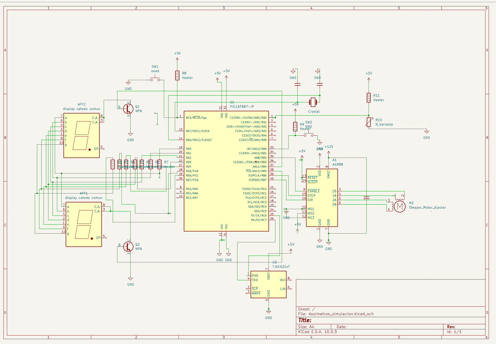
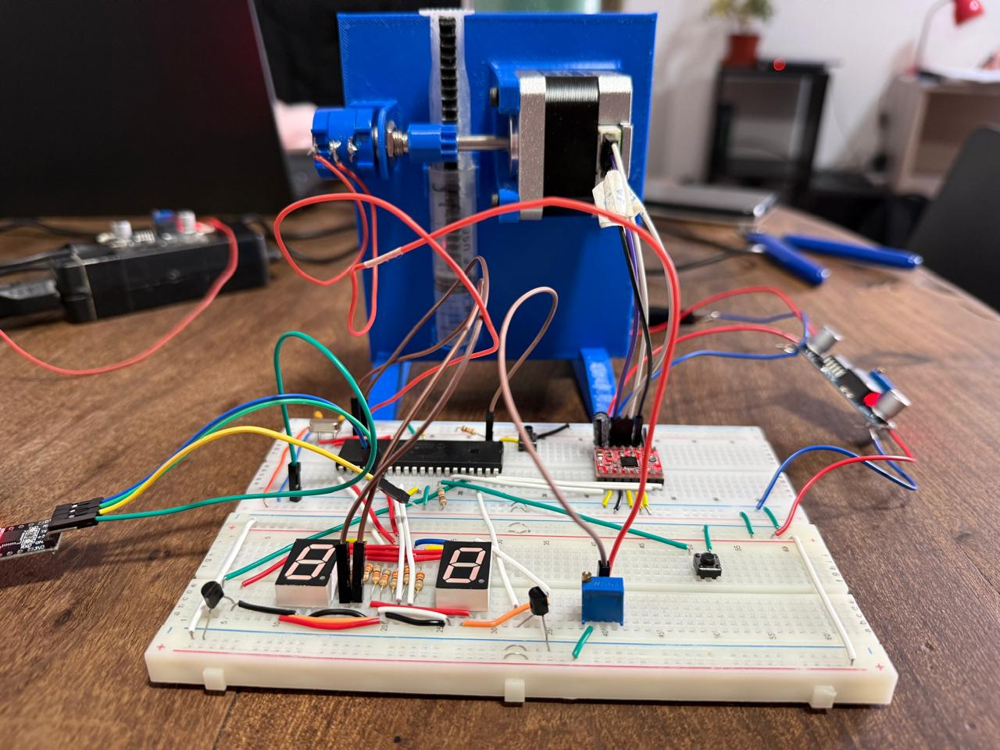
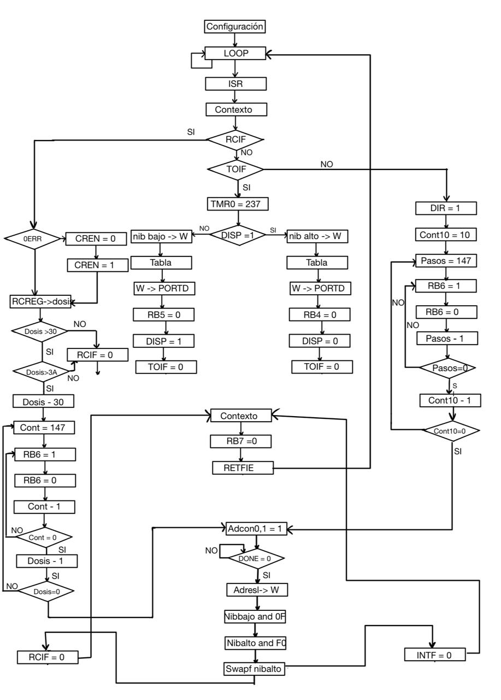
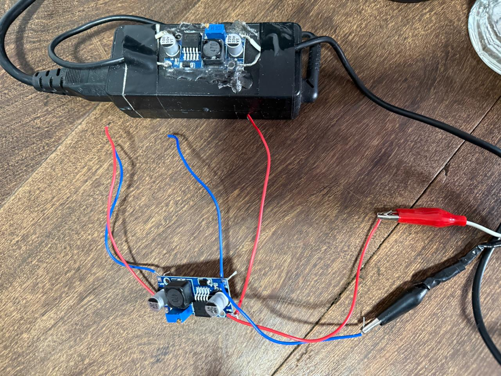
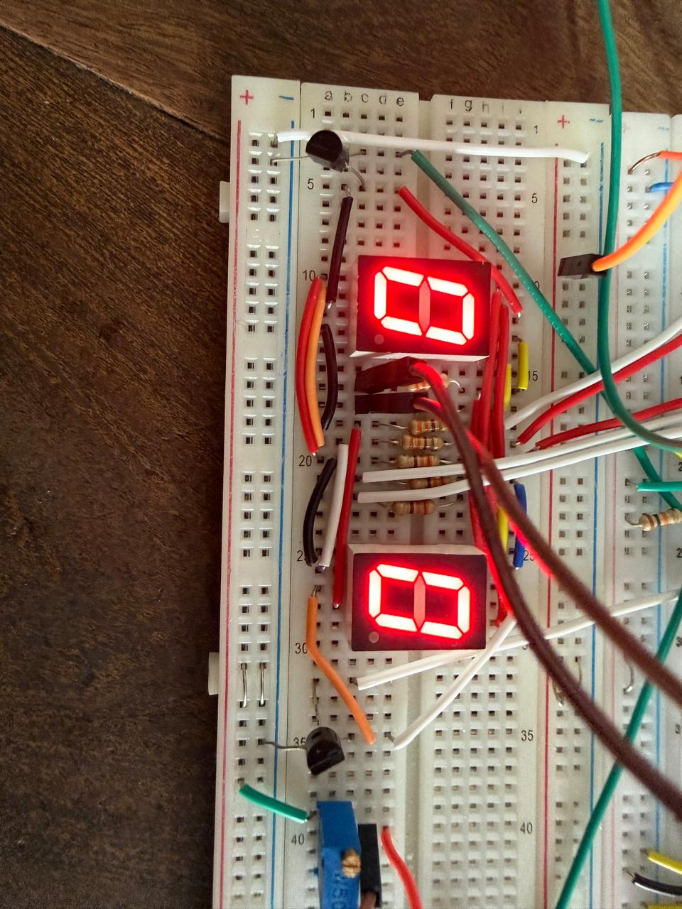
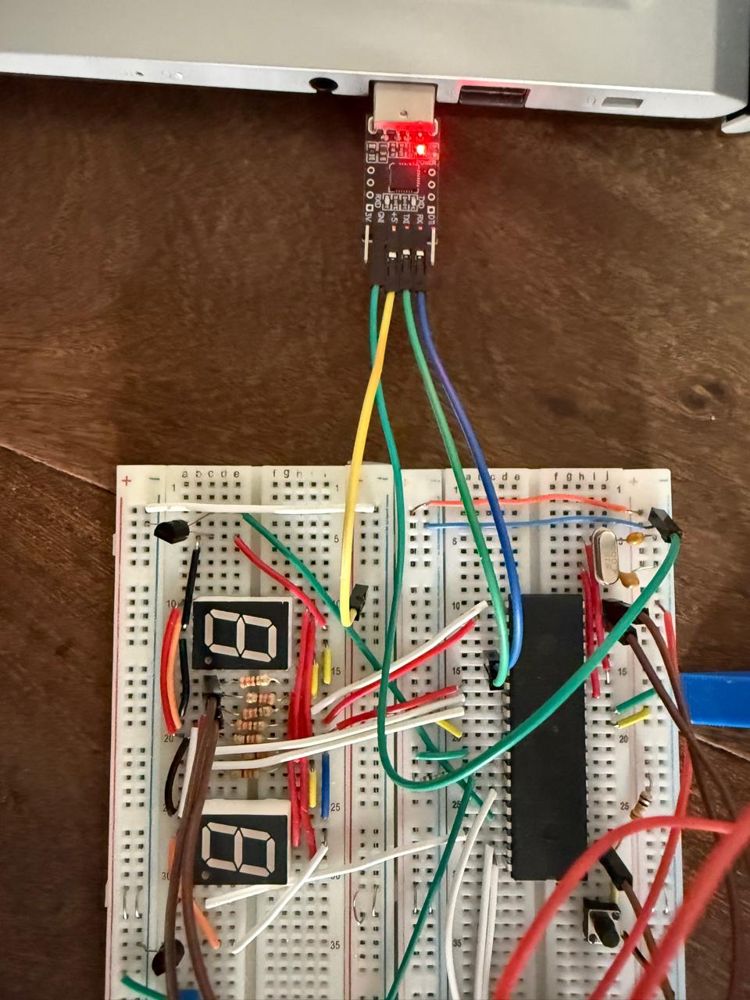
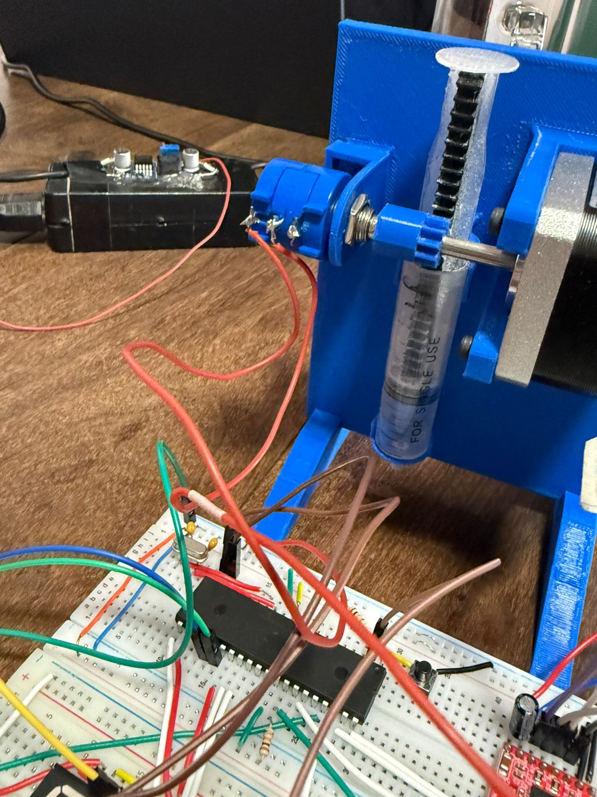
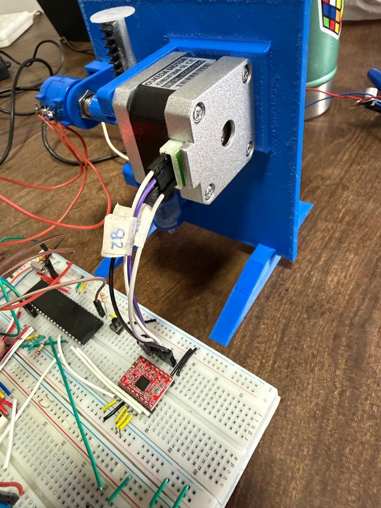

# Prototipo de bomba de infusión volumétrica automatizada con PIC16F887
Asignatura: Electrónica Digital II - Universidad Nacional de Córdoba 
Integrantes: Bagnera, Maria Emilia - Bauchwitz, Lautaro - Faimberg, Mijal
Profesor: Marcos Blasco

## 1. Descripción general del proyecto

El proyecto consiste en el desarrollo de una bomba de infusión automatizada controlado por un microcontrolador PIC16F887. El sistema permite accionar un motor paso a paso encargado de desplazar el émbolo de una jeringa, con el objetivo de dispensar un volumen de manera controlada. La cantidad de pasos o dosis puede ser ingresada desde una computadora mediante comunicación serie UART, mientras que el sistema muestra información en dos displays de 7 segmentos multiplexados.

---

## 2. Alcances del proyecto

### El sistema sí es capaz de:

* Controlar un motor paso a paso mediante un driver externo.
* Generar señales STEP y DIR desde el PIC16F887.
* Recibir datos desde una computadora mediante comunicación UART.
* Guardar el valor recibido en una variable interna del programa.
* Mostrar datos en dos displays de 7 segmentos.
* Multiplexar los displays utilizando interrupción por Timer0.
* Leer una señal analógica mediante el ADC interno del PIC.
* Utilizar un potenciómetro como entrada analógica para estimar posición o volumen.
* Detectar un pulsador externo conectado a RB0.
* Ejecutar una acción de recarga o movimiento a partir de una interrupción externa.
* Trabajar con alimentación lógica de 5 V y alimentación independiente para el motor.

### El sistema no incluye:

* Certificación médica para uso clínico real.
* Control cerrado de volumen con sensor calibrado de alta precisión.
* Almacenamiento de datos en tarjeta SD o memoria externa.
* Interfaz gráfica en computadora.
* Sistema de batería o bajo consumo.
* Sensores de presión, finales de carrera o detección automática de obstrucciones.
* Validación metrológica completa del volumen dispensado.

---

## 3. Posibles etapas siguientes

En una versión futura del sistema se podrían implementar las siguientes mejoras:

* Diseñar una placa PCB para reemplazar el montaje en protoboard.
* Agregar finales de carrera para detectar posición inicial y final del mecanismo.
* Calibrar la relación entre pasos del motor y volumen desplazado.
* Incorporar una interfaz gráfica en Python para ingresar dosis y visualizar el estado del sistema.
* Agregar registro de datos para almacenar dosis aplicadas.
* Incorporar una pantalla LCD u OLED para mejorar la visualización local.
* Implementar detección de errores ante trabas mecánicas o desconexión del motor.
* Diseñar una carcasa mecánica para fijar la jeringa, el motor y el sistema de transmisión.
* Mejorar el filtrado de la señal analógica del potenciómetro.

---

# 4. Arquitectura del sistema

## Hardware utilizado

El sistema está compuesto por los siguientes bloques:

* Microcontrolador PIC16F887.
* Cristal externo de 4 MHz.
* Driver A4988 para motor paso a paso.
* Motor paso a paso tipo NEMA 17.
* Jeringa acoplada mecánicamente al motor.
* Potenciómetro conectado a una entrada analógica.
* Dos displays de 7 segmentos cátodo común.
* Transistores para habilitar cada display en el multiplexado.
* Pulsador externo conectado a RB0.
* Comunicación UART con computadora.
* Fuente de 12 V para el motor.
* Regulador o módulo step-down de 5 V para la lógica digital.


## Esquemático del circuito

El siguiente esquemático muestra la conexión general entre el PIC16F887 y los módulos principales del sistema: alimentación, entrada analógica, comunicación UART, displays de 7 segmentos, pulsador externo y driver del motor paso a paso.



## Prototipo físico

La siguiente imagen muestra el montaje físico del sistema desarrollado, incluyendo el microcontrolador, la etapa de potencia, los elementos de visualización y el mecanismo asociado al accionamiento de la jeringa.



---

# 5. Descripción del circuito

El PIC16F887 funciona como unidad central de control. El microcontrolador recibe información desde una computadora mediante UART, lee una entrada analógica proveniente de un potenciómetro y genera señales digitales para controlar el driver del motor paso a paso. También controla dos displays de 7 segmentos mediante multiplexado.

Los segmentos de los displays se conectan al puerto D del PIC. La selección de cada display se realiza mediante transistores controlados desde pines del puerto B. El multiplexado se realiza alternando rápidamente la habilitación de cada display mediante interrupciones del Timer0, de manera que el usuario perciba ambos displays encendidos al mismo tiempo.

El motor paso a paso se controla mediante un driver externo. El PIC entrega las señales STEP y DIR, mientras que el driver se encarga de alimentar las bobinas del motor. La fuente de potencia del motor es independiente de la alimentación lógica del PIC, pero ambas deben compartir GND para que las señales de control tengan una referencia común.

El potenciómetro se conecta como divisor resistivo entre 5 V y GND. El terminal central del potenciómetro se conecta a una entrada analógica del PIC, por ejemplo AN0. Esta tensión es convertida por el módulo ADC y puede utilizarse para estimar posición del mecanismo o volumen restante.

---

# 6. Conexiones principales

## Alimentación

| Elemento                 | Conexión           |
| ------------------------ | ------------------ |
| PIC16F887                | 5 V                |
| Driver del motor         | 12 V para potencia |
| Lógica del driver        | 5 V                |
| GND del PIC              | GND común          |
| GND de la fuente de 12 V | GND común          |

## Microcontrolador PIC16F887

| Pin / Puerto | Función                             |
| ------------ | ----------------------------------- |
| RA0 / AN0    | Entrada analógica del potenciómetro |
| RB0          | Pulsador externo                    |
| RB4          | Habilitación display 1              |
| RB5          | Habilitación display 2              |
| RB6          | Señal STEP hacia el driver          |
| RB7          | Señal DIR hacia el driver           |
| RC6 / TX     | Transmisión UART                    |
| RC7 / RX     | Recepción UART                      |
| RD0 a RD7    | Segmentos de los displays           |
| OSC1 / OSC2  | Cristal externo de 4 MHz            |
| MCLR         | Reset externo del PIC               |

---

# 7. Arquitectura de software

## Herramientas utilizadas

* MPLAB X IDE v5.35.
* Ensamblador para PIC.
* Lenguaje Assembly.
* Microcontrolador PIC16F887.
* Bootloader AN1310 o programador compatible.
* Terminal serie para envío de datos desde la computadora.

## Periféricos internos utilizados

* Timer0 para multiplexado de displays.
* ADC para lectura del potenciómetro.
* EUSART/UART para comunicación serie.
* Interrupción externa por RB0.
* Puertos digitales para displays y control del motor.

## Configuración general

El sistema utiliza un cristal externo de 4 MHz. El Watchdog Timer se encuentra desactivado para evitar reinicios no deseados durante las pruebas. El pin MCLR se mantiene habilitado como reset externo. El módulo ADC se configura para leer el canal AN0. La comunicación UART se configura para recibir datos enviados desde una terminal serie en la computadora.

## Diagrama de flujo del firmware
El siguiente diagrama representa el flujo general del firmware implementado en el PIC16F887. Se muestra la inicialización de periféricos, el lazo principal y el orden de atención de interrupciones utilizado en el sistema.



---

# 8. Fuses o bits de configuración

Configuración utilizada:

```asm
__CONFIG _CONFIG1, _FOSC_XT & _WDTE_OFF & _PWRTE_ON & _MCLRE_ON & _CP_OFF & _BOREN_OFF & _IESO_OFF & _FCMEN_OFF & _LVP_OFF
__CONFIG _CONFIG2, _WRT_OFF & _BOR4V_BOR40V
```

Descripción:

| Parámetro                    | Configuración             |
| ---------------------------- | ------------------------- |
| Oscilador                    | XT, cristal externo       |
| Frecuencia                   | 4 MHz                     |
| Watchdog Timer               | Desactivado               |
| Power-up Timer               | Activado                  |
| MCLR                         | Activado como pin externo |
| Code Protection              | Desactivado               |
| Brown-out Reset              | Desactivado               |
| Low Voltage Programming      | Desactivado               |
| Fail-Safe Clock Monitor      | Desactivado               |
| Internal/External Switchover | Desactivado               |

---

# 9. Gestión de interrupciones

El PIC16F887 posee un único vector de interrupción en la dirección 0x04. Por este motivo, dentro de la rutina de interrupción se debe consultar qué bandera generó el evento.

El orden de atención utilizado o propuesto es:

1. UART: se atiende primero para guardar el dato recibido desde la computadora y evitar pérdida de información. Esta prioridad permite que el sistema no pierda caracteres enviados desde el teclado.
2. RB0: se atiende luego para detectar el pulsador externo, utilizado para iniciar una acción manual del sistema, como recarga o movimiento.
3. Timer0: se atiende después para mantener el multiplexado de los displays de 7 segmentos.
4. ADC: si se utiliza para la conversión, se atiende luego de las tareas principales.

Este criterio permite mantener estable la visualización y atender correctamente la comunicación serie y las entradas externas.

---

# 10. Funcionamiento general del firmware

El programa comienza configurando los puertos del microcontrolador, los registros de interrupción, el Timer0, el ADC y la UART. Luego entra en un lazo principal infinito donde el sistema queda esperando eventos.

Cuando se recibe un dato por UART, el valor se guarda en una variable interna. Ese dato puede ser utilizado para definir la cantidad de pasos del motor o para actualizar la visualización en los displays. Cuando se genera una interrupción por Timer0, el firmware alterna entre los dos displays para lograr el multiplexado.

Cuando se presiona el pulsador conectado a RB0, el sistema ejecuta una acción definida, como iniciar una recarga completa o mover el motor una cantidad determinada de pasos. La lectura del potenciómetro mediante ADC permite obtener una referencia analógica asociada a la posición del sistema.

---
# 12. Ensayos y pruebas realizadas

Prueba de alimentación

Se midió la tensión de alimentación del PIC y del driver del motor. Se verificó la presencia de 5 V para la lógica y 12 V para la etapa de potencia. También se comprobó que ambas fuentes compartieran GND.

Evidencia:



Prueba de displays

Se cargaron valores de prueba en las variables internas y se comprobó la correcta visualización en los dos displays de 7 segmentos. También se verificó que el multiplexado no produjera parpadeo visible.

Evidencia:


Prueba de comunicación UART

Se enviaron caracteres numéricos desde una terminal serie en la computadora. El PIC recibió los datos mediante el módulo EUSART y los almacenó en una variable interna.

Evidencia:


Prueba del ADC

Se varió la posición del potenciómetro conectado a AN0 y se verificó el cambio en el valor convertido por el ADC. Esta prueba permitió comprobar que el microcontrolador detecta correctamente variaciones analógicas.

Evidencia:


Prueba del motor

Se enviaron pulsos STEP al driver del motor paso a paso y se verificó el movimiento del eje. También se probó la señal DIR para modificar el sentido de giro.

Evidencia:



---


# 13. Resultados obtenidos

El prototipo permitió validar el funcionamiento básico de un dosímetro volumétrico automatizado. Se logró controlar el motor paso a paso mediante el PIC16F887, visualizar información en displays de 7 segmentos, recibir datos desde una computadora por UART y leer una señal analógica mediante el ADC.

Los resultados obtenidos demuestran que el sistema cumple con los objetivos principales planteados para la entrega final. Sin embargo, para una aplicación profesional sería necesario mejorar la calibración del volumen, incorporar sensores de seguridad, diseñar una PCB, realizar mediciones de repetibilidad y validar el sistema bajo condiciones controladas.

---

# 14. Estructura sugerida del repositorio

```text
dosimetro-pic16f887/
│
├── README.md
│
├── firmware/
│   └── main.asm
│
├── hardware/
│   ├── esquematico.png
│   └── dosimetros_simulacion
│
├── docs/
    ├── diagrama_bloques.png
    ├── diagrama_software.png
    ├── medicion_alimentacion.png
    ├── prueba_displays.png
    ├── terminal_uart.png
    ├── prueba_adc.png
    ├── prueba_motor.png
    └── prototipo_final.png

```

---

# 15. Conclusión

El proyecto permitió integrar distintos contenidos de electrónica digital y sistemas embebidos, incluyendo programación en Assembly, manejo de interrupciones, comunicación UART, conversión analógica-digital, multiplexado de displays y control de motores paso a paso.

El sistema desarrollado constituye una base funcional para un dosificador volumétrico automatizado. Aunque el prototipo no está diseñado para uso clínico real, permite demostrar el principio de funcionamiento y deja planteadas mejoras futuras relacionadas con seguridad, precisión, calibración y robustez del diseño.
